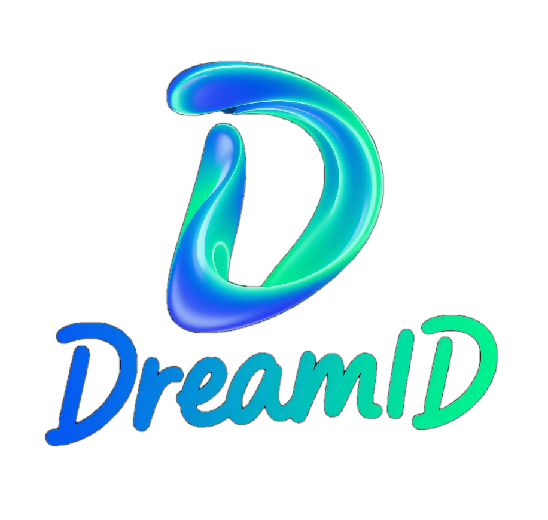
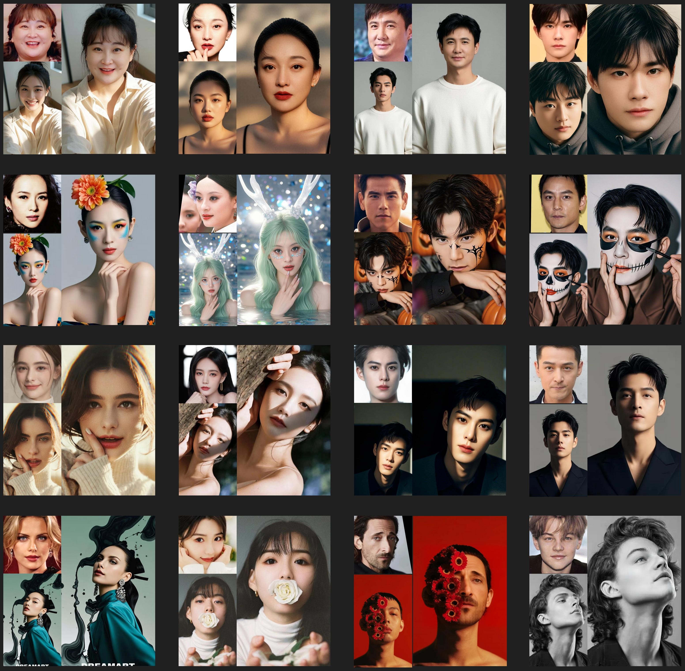
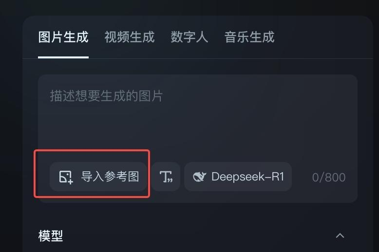
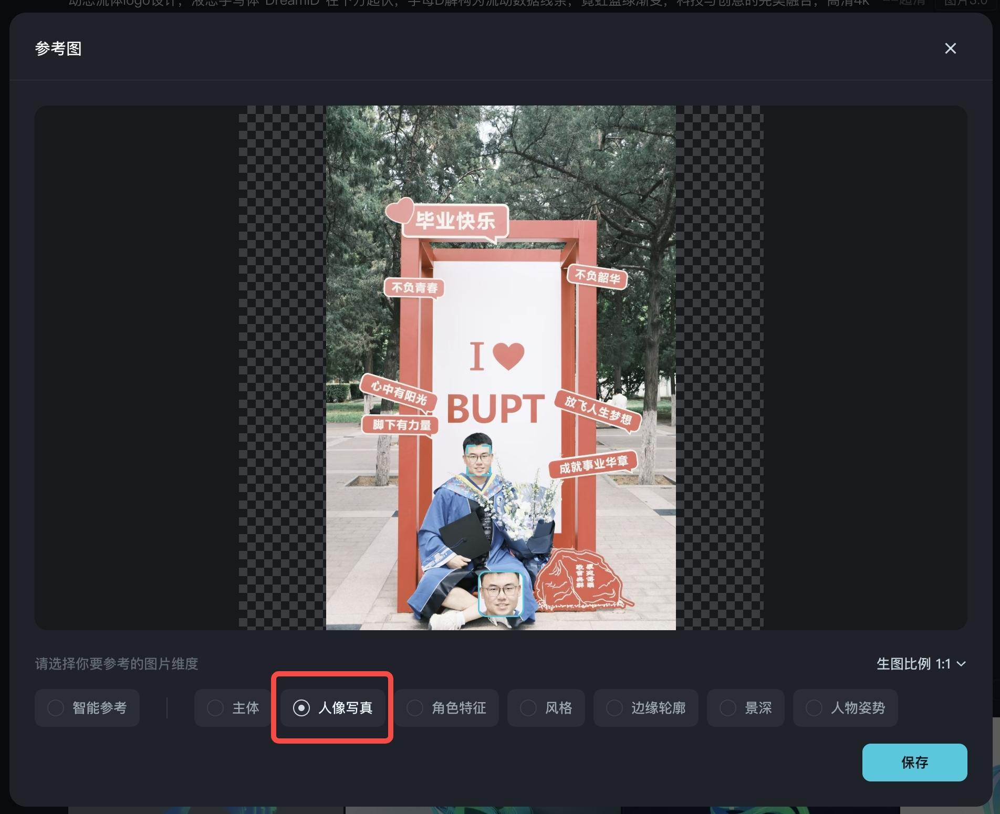
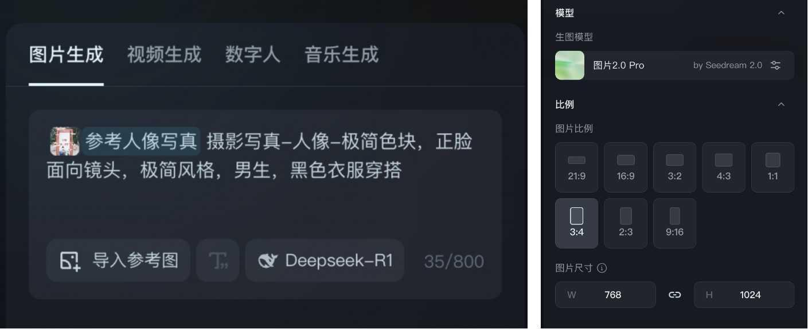
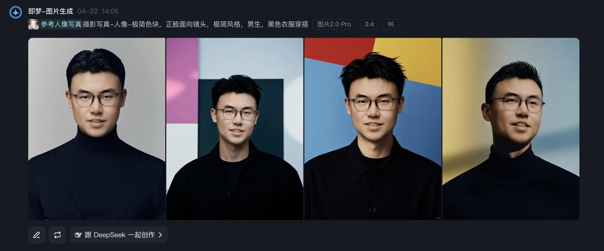

<h3 align="center">
    
    DreamID: A Fast and High-Fidelity diffusion-based Face Swapping via Triplet ID Group Learning
</h3>

<p align="center"> 
<!-- <a href="https://github.com/bytedance/UNO"></a>  -->
<a href="https://superhero-7.github.io/DreamID/"></a> 
<a href="https://arxiv.org/abs/2504.14509"></a>
<a href="https://jimeng.jianying.com/ai-tool/image/generate"></a> 
<!-- <a href="https://huggingface.co/bytedance-research/UNO"></a> -->
<!-- <a href="https://huggingface.co/spaces/bytedance-research/UNO-FLUX"></a> -->
</p>

<div align="center">
  <p>
    <a href="https://scholar.google.com/citations?user=-BbQ5VgAAAAJ&hl=en&oi=ao">Fulong Ye</a>, 
    <a href="https://scholar.google.com/citations?user=gvUL1ZoAAAAJ&hl=en">Miao Hua</a>, 
    <a href="https://github.com/PangzeCheung">Pengze Zhang</a>, 
    <a href="https://github.com/Crayon-Shinchan">Xinghui Li</a>, 
    <a href="https://github.com/sun631998316">Qichao Sun</a>, 
    <a href="https://crayon-shinchan.github.io/AnyDressing.github.io/">Songtao Zhao</a>, 
    <a href="https://scholar.google.com/citations?view_op=list_works&hl=zh-CN&authuser=1&user=9rWWCgUAAAAJ">Qian He</a>, 
    <a href="https://scholar.google.com/citations?user=LVsp9RQAAAAJ&hl=zh-CN">XingLong Wu</a>
  </p>
</div>

><p align="center"> 
><span style="font-size: 16px">Intelligent Creation Team, ByteDance</span></p>


## 🔥 News
- [2026.01.06] 🎉 Our video version [DreamID-V](https://github.com/bytedance/DreamID-V) is released! 
- [2025.08.11] 🎉 DreamID accepted by SIGGRAPH Asia 2025!
- [04/21/2025] 🔥 Our project [DreamID](https://superhero-7.github.io/DreamID/) is released.
- [04/23/2025] 🔥 Our paper [DreamID](https://arxiv.org/abs/2504.14509) is released.


## 📖 Introduction
We introduce DreamID, a high-similarity, fast, and high-fidelity diffusion-based face-swapping model. You can try out our model in <a href="https://jimeng.jianying.com/ai-tool/image/generate" target="_blank">Dreamina</a>.<br>

<p align="center">

</p>

DreamID achieves high-fidelity face swapping with unprecedented identity similarity—to our knowledge, it currently ranks as the most identity-preserving face-swapping model. It addresses long-standing challenges in the field, such as facial shape deformation, while excelling in attribute preservation (e.g., makeup, lighting) at a fine-grained level. Moreover, DreamID demonstrates robust performance under occlusions and extreme head poses.


<!-- ### 📌 Tips and Notes
We integrate single-subject and multi-subject generation within a unified model. For single-subject scenarios, the longest side of the reference image is set to 512 by default, while for multi-subject scenarios, it is set to 320. UNO demonstrates remarkable flexibility across various aspect ratios, thanks to its training on a multi-scale dataset. Despite being trained within 512 buckets, it can handle higher resolutions, including 512, 568, and 704, among others.

UNO excels in subject-driven generation but has room for improvement in generalization due to dataset constraints. We are actively developing an enhanced model—stay tuned for updates. Your feedback is valuable, so please feel free to share any suggestions. -->

<!-- ## 🎨 Application Scenarios
<p align="center">

</p> -->

### 🎨 Enjoy on [Dreamina](https://jimeng.jianying.com/ai-tool/home)
DreamID is applied in Dreamina, ByteDance. You can also enjoy the more advanced customization algorithm in Dreamina!

#### Step 1: Upload your own image: 
Select generate in image generator.
<p align="center">

</p>
Click to import the reference image.
<p align="center">

</p>
Select one of your own images to upload, and click on portrait photography(Human Face).
<p align="center">

</p>

#### Step 2: Write the prompt and then enjoy your result.
Use your imagination to write the prompt according to your needs, and choose the appropriate model and image ratio parameters.
<p align="center">

</p>
Finally, enjoy your result!
<p align="center">

</p>

## 📄 Disclaimer
<p>
This research aims to advance the field of generative AI. Users are free to 
create images using this tool, provided they comply with local laws and exercise 
responsible usage. The developers are not liable for any misuse of the tool by users.</p>

<!-- ## 🚀 Updates -->

## Hire
We are recruiting individuals interested in face swap technology, whether for full-time or internships. Feel free to contact us! Email:yefulong@bytedance.com

##  Citation
If DreamID is helpful, please help to ⭐ the repo.

If you find this project useful for your research, please consider citing our paper:
```bibtex
@misc{ye2025dreamidhighfidelityfastdiffusionbased,
      title={DreamID: High-Fidelity and Fast diffusion-based Face Swapping via Triplet ID Group Learning}, 
      author={Fulong Ye and Miao Hua and Pengze Zhang and Xinghui Li and Qichao Sun and Songtao Zhao and Qian He and Xinglong Wu},
      year={2025},
      eprint={2504.14509},
      archivePrefix={arXiv},
      primaryClass={cs.CV},
      url={https://arxiv.org/abs/2504.14509}, 
}
```
